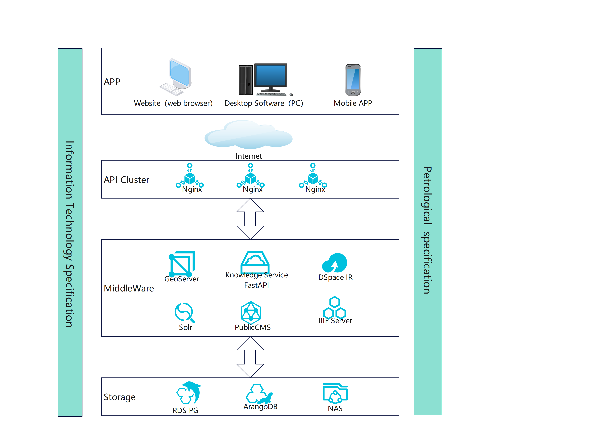

# OnePetrology
 Belonging to the DDE International Big Science Program, it focuses on the research of igneous rock discipline and adopts a "library graphics and text" three in one approach to conduct discipline research by building databases and conducting mapping. 

[visit OnePetrology](https://dde.igeodata.org)

