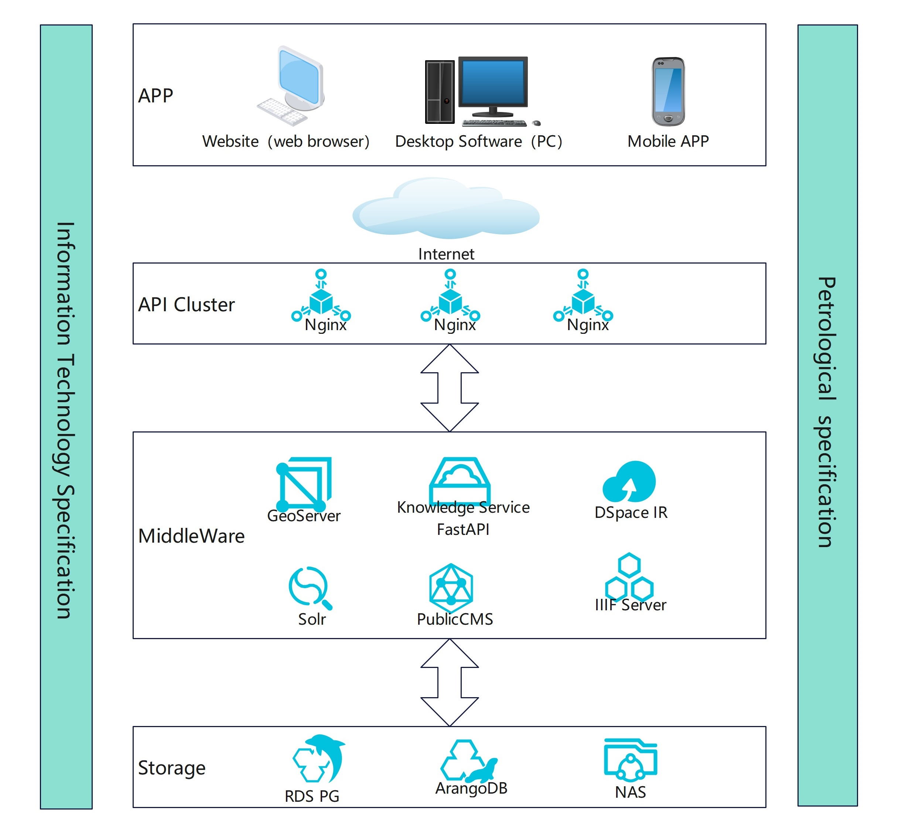

# OnePetrology
 
     查看中文版本[中文版](README.zh.md)

Belonging to the DDE International Big Science Program, it focuses on the research of igneous rock discipline and adopts a "Data——Mapping——Papers" three in one approach to conduct discipline research by building databases and conducting mapping. 

[visit OnePetrology](https://dde.igeodata.org)

The magma rock database is built using open-source software and self-developed methods. In this open-source project, it is divided into "1 cloud+3 end+tool set", which correspond to the following subdirectories. The construction order is: 1) configuring the server end; 2) deploying web end, desktop program end, and mobile app as needed; 3) deploying tool software set as needed.

Tips: Need to be familiar with technologies such as Java, type script, Python, Arangodb, Pandas, Pyqt, WebGIS, Leaflet, FastAPI, DSSpace, etc. If you need further assistance or would like to join the development, please feel free to contact us: onepetrology@126.com.

