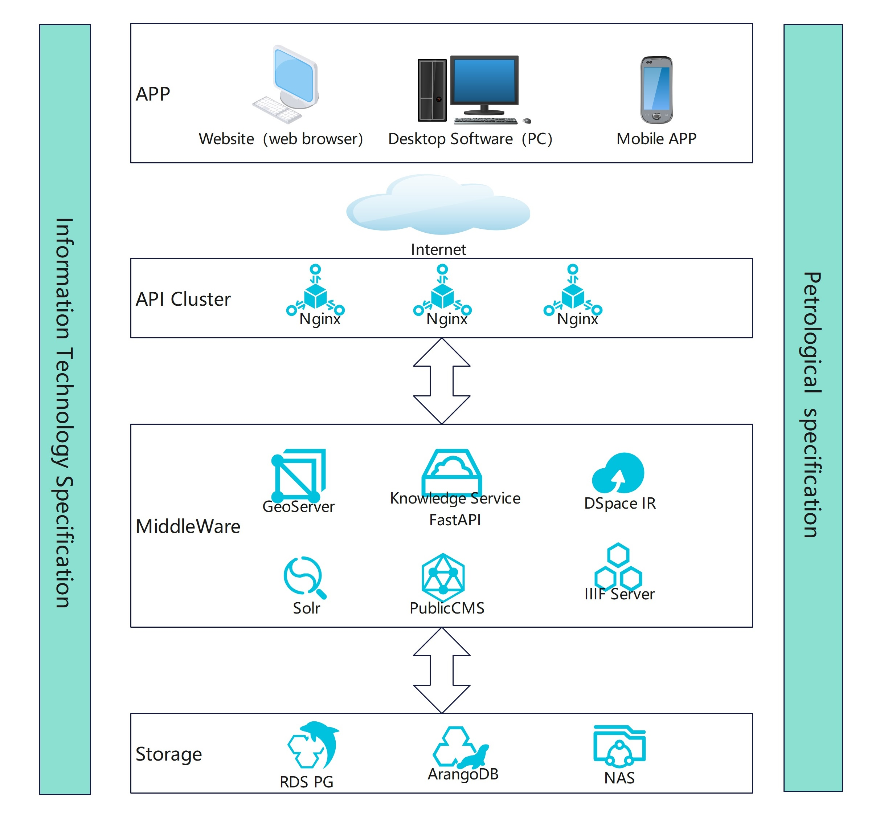

# OnePetrology
 

OnePetrology属于DDE国际大科学计划，专注于岩浆岩学科的研究，采用“库-图-文”三位一体的科研方法，通过建立数据库和进行映射来进行学科研究。

[visit OnePetrology](https://dde.igeodata.org)

岩浆岩数据库是使用开源软件和自行开发的方法建立的。在这个开源项目中，它被分为“1云+3端+工具集”，对应以下子目录。建设顺序为：1）配置服务器端；2） 根据需要部署web端、桌面程序端和移动应用程序；3） 根据需要部署工具软件集。

温馨提示：需要熟悉Java、type script、Python、Arangodb、Pandas、Pyqt、WebGIS、leaflet、FastAPI、DSpace等技术。如果您需要进一步的帮助或想加入开发，请随时与我们联系：onepetrology@126.com.
